<!-- ═══════════════════════════════════════════════════════════════ -->
<!--              SANYUKT KUMAR RAI — GITHUB PROFILE README          -->
<!--          Hacker Green  ×  Dark Charcoal  ×  Minecrafty          -->
<!-- ═══════════════════════════════════════════════════════════════ -->

<p align="center">
  
</p>

<br/>

<!-- ── TYPING ANIMATION ──────────────────────────────────────────── -->
<p align="center">
  
</p>

<!-- ── QUICK BADGES ─────────────────────────────────────────────── -->
<p align="center">
  
  &nbsp;
  
  &nbsp;
  
  &nbsp;
  
</p>

<br/>

---

<!-- ── ABOUT ME ──────────────────────────────────────────────────── -->
## 🧑‍💻 &nbsp;About Me

```yaml
NAME    : Sanyukt Kumar Rai
ROLE    : Full Stack Developer | AI/ML | Graphics Designer
FOCUS   : Building intelligent, beautiful, functional products
MOTTO   : "Design with purpose. Code with precision."
STATUS  : Open to Work  ✅
```

&nbsp;

- 🎨 &nbsp;**Graphics Designer** — clean interfaces, sharp visuals, premium feel
- 💻 &nbsp;**Full Stack Developer** — end-to-end web apps that actually work
- 🤖 &nbsp;**AI / ML Explorer** — turning models into real-world products
- 📦 &nbsp;**Open Source** advocate and lifelong learner
- ⚡ &nbsp;Fun fact: I prototype ideas overnight and ship them by morning

&nbsp;

---

<!-- ── GITHUB ANALYTICS ──────────────────────────────────────────── -->
## 📊 &nbsp;GitHub Analytics & Activity

<p align="center">
  
</p>
<p align="center">
  
</p>

<br/>

---
<!-- ── TECH STACK ─────────────────────────────────────────────────── -->
## 🛠️ &nbsp;Tech Stack & Tools

### &nbsp;⌨️ Languages

<p>
  
</p>

### &nbsp;🧩 Frameworks & Libraries

<p>
  
</p>

### &nbsp;🗄️ Databases & Cloud

<p>
  
</p>

### &nbsp;🤖 AI / Machine Learning

<p>
  
  
  
  
  
</p>

<p>
  
  
  
  
  
</p>

<p>
  
  
  
  
  
  
</p>

### &nbsp;🎨 Design Tools

<p>
  
</p>

### &nbsp;⚙️ Dev Tools & Platforms

<p>
  
</p>

<br/>

---

<!-- ── CONNECT ─────────────────────────────────────────────────────── -->
## 🌐 &nbsp;Let's Connect

<p align="center">
  <a href="https://www.linkedin.com/in/sanyuktkummarrai" target="_blank">
    
  </a>
  &nbsp;
  <a href="https://x.com/sanyukt12" target="_blank">
    
  </a>
  &nbsp;
  <a href="https://www.instagram.com/sanyukt.311" target="_blank">
    
  </a>
  &nbsp;
  <a href="https://leetcode.com/u/Sanyukt777/" target="_blank">
    
  </a>
  &nbsp;
  <a href="#" target="_blank">
    
  </a>
  &nbsp;
  <a href="mailto:sanyukt63@gmail.com" target="_blank">
    
  </a>
</p>

<br/>

---

<!-- ── DEV QUOTE ──────────────────────────────────────────────────── -->
## 💬 &nbsp;Dev Quote of the Day

<p align="center">
  
</p>

<br/>

---

<!-- ── FOOTER ─────────────────────────────────────────────────────── -->
<p align="center">
  
</p>

<p align="center">
  <b>⛏️ &nbsp; Design. Code. Innovate. &nbsp; ⛏️</b>
</p>

<p align="center">
  <sub>Made with ❤️ and <b>too much caffeine</b> by Sanyukt Kumar Rai</sub>
</p>
