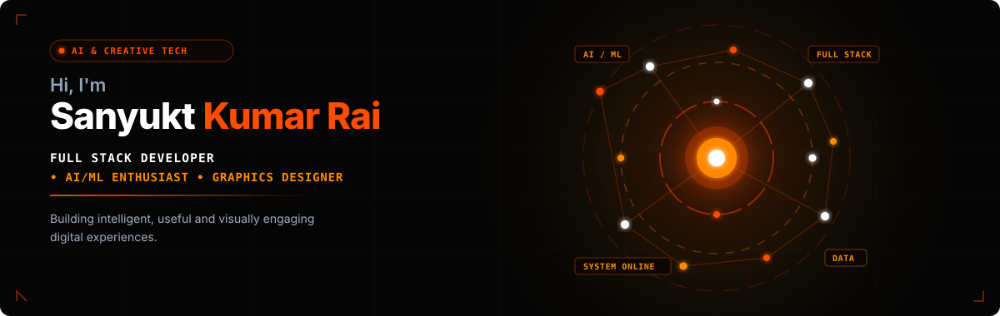

  

  <strong>Full-Stack Developer • AI/ML Explorer • Builder</strong>

  
  
  

## 👋 About Me

I'm Sanyukt Kumar Rai, a developer who likes turning ideas into practical products. I enjoy building full-stack applications, experimenting with AI/ML, and designing interfaces that are easy to use.

- 💻 Building full-stack web applications
- 🤖 Exploring AI/ML through practical projects
- 🎨 Interested in UI, visual design, and developer experience
- 🌱 Improving DSA, system thinking, and open-source practices
- 🚀 Currently focused on shipping small, useful projects instead of just tutorials

## ⭐ Projects I'm Building

| Project | What it does | Stack |
| --- | --- | --- |
| **[CrisisNav](https://github.com/sanyukt63/CrisisNav)** | Offline-first emergency guidance and crisis protocols | JavaScript, Node.js, PWA |
| **[CodeCraft](https://github.com/sanyukt63/CodeCraft)** | Interactive programming-learning platform | HTML, CSS, JavaScript |
| **[HireSense AI](https://github.com/sanyukt63/HireSense-AI)** | Resume screening and recruitment platform under active development | Django, PostgreSQL, AI/ML |
| **[Quick-Cure](https://github.com/sanyukt63/Quick-Cure)** | Smart appointment-booking application | Web application |

> 🔨 I care about useful software, clear documentation, and projects that other developers can actually run and build on.

## 🛠️ Tech

**Languages:** C • Java • Python • JavaScript • HTML • CSS • SQL

**Web & Backend:** Django • Node.js • Express • REST APIs

**Data & AI:** PostgreSQL • MySQL • NumPy • Pandas • Scikit-learn • TensorFlow • PyTorch • OpenCV

**Tools:** Git • GitHub • Docker • VS Code • Postman • Linux

## 📈 GitHub Activity

  

## 🤝 Let's Connect

- 💼 [LinkedIn](https://www.linkedin.com/in/sanyuktkummarrai)
- 🌐 [Portfolio](https://github.com/sanyukt63/Portfolio-website)
- 🧩 [LeetCode](https://leetcode.com/u/Sanyukt777/)
- 𝕏 [X](https://x.com/sanyukt12)

  Build something useful. Share it. Improve it.

